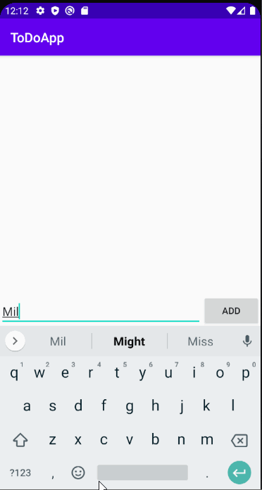

# ToDoApp
# CodePath (Pre-Work)- *ToDoApp*

**ToDoApp** is an android app that allows building a todo list and basic todo items management functionality including adding new items, editing and deleting an existing item.

Submitted By: **Elaine Chen**

Time spent: **10** hours spent in total

## User Stories

* [x] Required: **View a list of todo items**
* [x] Required: **Successfully add and remove items**
* [x] Required: **List of items persisted** 
* [x] Optional: **Tap a todo item in the list and bring up an edit screen for the todo item**

## Video Walkthrough

Here's a walkthrough of implemented user stories:

GIF created with [LiceCap](http://www.cockos.com/licecap/).

## License

    Copyright [2020] [Elaine Chen]

    Licensed under the Apache License, Version 2.0 (the "License");
    you may not use this file except in compliance with the License.
    You may obtain a copy of the License at

        http://www.apache.org/licenses/LICENSE-2.0

    Unless required by applicable law or agreed to in writing, software
    distributed under the License is distributed on an "AS IS" BASIS,
    WITHOUT WARRANTIES OR CONDITIONS OF ANY KIND, either express or implied.
    See the License for the specific language governing permissions and
    limitations under the License.
